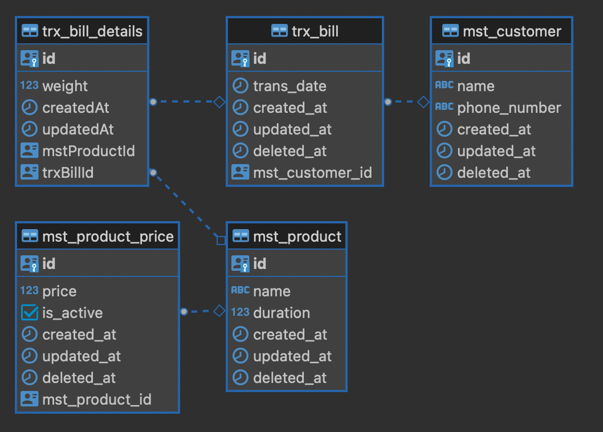

## Laundry Yuk Apps

### ERD


### Run
```bash
npm run start:dev
```

### Server
#### Customer
`POST`, `GET ALL`
```bash
localhost:8181/customers
```
`GET ID`
```bash
localhost:8181/customers/:id
```

### Payload
#### Customer
```json
{
    "name": "Jution Candra Kirana",
    "phoneNumber": "082180221160"
}
```